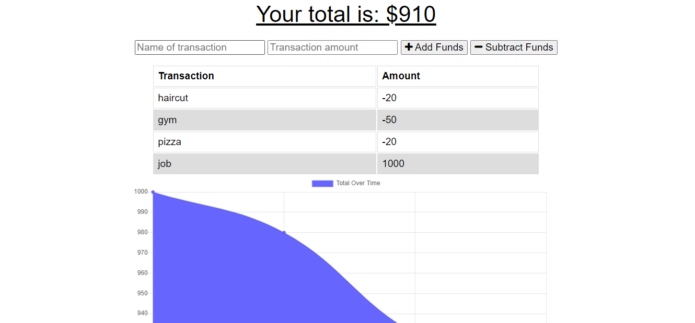

# offline-budget-tracker
built a app that has online and offline functionally 

## Tech used
* mongo
* express
* mongoose
* morgan
* compression
* lite-server

## Installation
you will need to have node already installed on you computer than you will have to run this command inside of you terminal to installed the dependencies

```
npm i express mongoose mongo morgan compression lite-server
```

## User Story
AS AN avid traveller
I WANT to be able to track my withdrawals and deposits with or without a data/internet connection
SO THAT my account balance is accurate when I am traveling

## Business Context

Giving users a fast and easy way to track their money is important, but allowing them to access that information anytime is even more important. Having offline functionality is paramount to our applications success.

## Screenshot



## Github repo link
https://github.com/ScottLRay/offline-budget-tracker

## Heroku deployed link
https://budget-tracker-offline-900.herokuapp.com/
